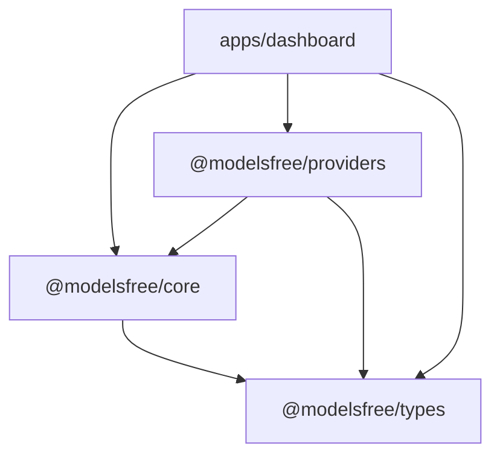

<p align="center">
  
  
  
  
</p>

# 🚀 ModelsFree

**The Ultimate Discovery Dashboard for Free Coding LLMs.**

ModelsFree is a high-performance, developer-centric dashboard designed to help you discover, compare, and integrate free coding-optimized Large Language Models. Built on a modular monorepo architecture, it provides real-time insights into 117+ models from the industry's leading providers.

---

## 🔥 Key Pillars

### ⚡ Performance First
Explore models optimized specifically for code generation, sorted by **SWE-bench Verified** scores. Get real-time latency metrics and context window details at a glance.

### 🌐 Universal Integration
Supports **9 major providers** out of the box. Generate configuration files for your favorite CLI tools (like OpenCode) with one click.

### 🔒 Privacy Driven
Your API keys never leave your browser. All configuration is stored locally in your browser's `localStorage` and sent directly to the provider endpoints.

---

## 🏗️ Technical Architecture

ModelsFree is built using a modern **Turborepo/pnpm monorepo** structure, ensuring strict type safety and modularity.



### 📦 Modular Breakdown
- **`@modelsfree/types`**: Single source of truth for Zod schemas and TypeScript interfaces.
- **`@modelsfree/core`**: Pure business logic for metrics calculation, sorting, and filtering algorithms.
- **`@modelsfree/providers`**: Deeply typed model definitions and provider-specific configurations.
- **`apps/dashboard`**: A premium Next.js 15 frontend with Shadcn/UI and dark mode support.

---

## 🌐 Supported Providers

| Provider | Models | Best For | API Key Link |
| :--- | :---: | :--- | :--- |
| **NVIDIA NIM** | 43 | High context & speed | [Get NIM Key](https://build.nvidia.com) |
| **Groq** | 11 | Ultra-low latency | [Get Groq Key](https://console.groq.com/keys) |
| **OpenRouter** | 26 | Universal model access | [Get OR Key](https://openrouter.ai/keys) |
| **Google AI** | 6 | Gemini & Gemma ecosystem | [Get AI Studio Key](https://aistudio.google.com/apikey) |
| **SambaNova** | 12 | Large model trial credits | [Get SambaNova Key](https://cloud.sambanova.ai) |
| **Cerebras** | 4 | Real-time performance | [Get Cerebras Key](https://cloud.cerebras.ai) |
| **Mistral AI** | 8 | Native Mistral models | [Get Mistral Key](https://console.mistral.ai) |
| **Scaleway** | 6 | European cloud hosting | [Get Scaleway Key](https://console.scaleway.com) |
| **Codestral** | 1 | Dedicated coding API | [Get Codestral Key](https://codestral.mistral.ai) |

---

## 🛠️ Getting Started

### 1. Installation
Clone the repository and install dependencies using **pnpm**.

```bash
git clone https://github.com/gfdev10/Free-Models-IA.git
cd Free-Models-IA
pnpm install
```

### 2. Development
Launch the dashboard in development mode.

```bash
pnpm dev
```
Open [http://localhost:3000](http://localhost:3000) to explore the local dashboard.

### 3. Build & Production
Generate a production-ready bundle.

```bash
pnpm build
pnpm start
```

---

## 🔑 Environment Setup

Configure your API keys in `apps/dashboard/.env.local` to enable global access, or use the in-dashboard **Settings** page for browser-local storage.

```env
NVIDIA_API_KEY=your_key
OPENROUTER_API_KEY=your_key
GROQ_API_KEY=your_key
CEREBRAS_API_KEY=your_key
SAMBANOVA_API_KEY=your_key
CODESTRAL_API_KEY=your_key
GOOGLE_API_KEY=your_key
MISTRAL_API_KEY=your_key
SCALEWAY_API_KEY=your_key
```

---

## 📊 Deployment

Deployed with ❤️ via **Vercel**. Check out the live version: [modelsfree.vercel.app](https://modelsfree.vercel.app)

---

<p align="center">
  Built by <strong><a href="https://gfdev.vercel.app">gfdev</a></strong> • Licensed under MIT
</p>
